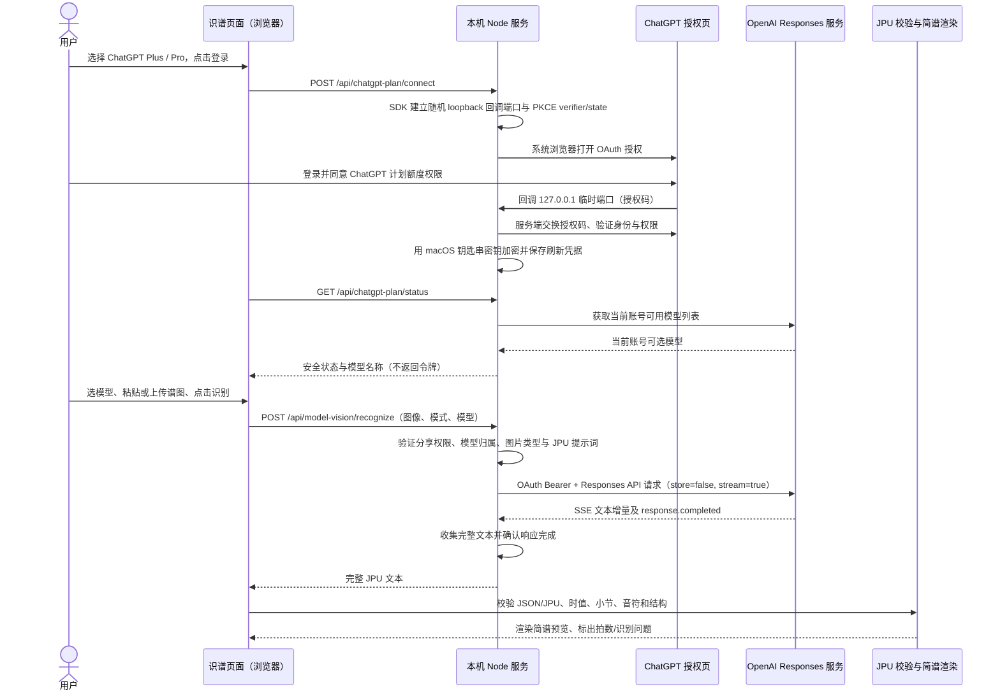

# ChatGPT 登录授权与视觉识谱调用链

本文说明本项目的本机 ChatGPT Plus / Pro 授权模式如何登录、提交简谱图片、读取模型输出并生成页面预览。它与 OpenAI API Key 模式是两条不同的认证链路。

## 整体流程

## 登录与 OAuth

页面点击“继续使用 ChatGPT 登录”后，浏览器只向本机 Node 服务发送一个开始授权请求。SDK 在本机生成随机 `state`、PKCE verifier/challenge 和短时 loopback 回调监听器，然后由 macOS `open` 打开 OpenAI 授权页。回调绑定到 `127.0.0.1` 上动态分配的端口，不经过项目页面 JavaScript 中转。

浏览器完成登录后，OpenAI 将一次性授权码回传给本机回调。SDK 校验 `state` 和 PKCE，后端用授权码交换 OAuth token，并验证 ID token 的签名、issuer、audience 和有效期。权限中必须包含 `chatgpt.tokens.use.direct` 才表示账号同意本应用使用 ChatGPT 计划额度。OAuth access/refresh token 与身份信息仅供本机后端使用，不返回给浏览器。

首次授权与重新同意权限使用同一按钮入口。若账号已登录但没有计划额度权限，页面显示“启用 ChatGPT 计划额度”；该操作要求用户再次去授权页明确同意。点“断开 ChatGPT 登录”会调用 SDK 断开会话并清除本机保存的 OAuth 凭据。

此流程不是把 ChatGPT 网页聊天窗口自动化，也不是使用浏览器 Cookie。它不读取其他 ChatGPT 对话。模型调用是用户在本页面发起的独立请求。

## 凭据如何保存在本机

凭据文件由 SDK 写入 `~/.config/jianpu-melody-editor/chatgpt/`，目录和文件设为当前用户私有。文件内容使用 AES-256-GCM 加密；随机加密密钥单独保存在 macOS Keychain 的通用密码项中。Swift helper 仅执行 Keychain get/set，不打印密钥到服务日志。浏览器端仅收到连接状态、账号邮箱（若可用）和模型清单。

Swift helper 的模块缓存放在系统临时目录，避免首次编译时写入项目目录或用户的通用编译缓存。Keychain 不可用或锁定时，页面必须明确显示状态并停止识谱请求，不能降级为明文保存。已存在的凭据文件不会因读写失败自动删除。

## 图片如何发送

浏览器允许 PNG、JPEG、WebP；最多 12 张，图片总大小不超过 12 MB。用户粘贴屏幕截图时，页面从剪贴板读取图片文件。点击识别后，前端将图片编码为 Base64，并通过同源 HTTPS/loopback 本地接口传给 Node 服务；本机服务再次验证 MIME 类型、大小、所选模式、JSON/JPU 规则和模型。

Node 服务把图像转成 Responses API 的 `input_image` data URL，JPU 输出规范放入 `instructions`，图像放在一条 `user` input message 中。用户选中的模型必须来自该 ChatGPT 账号当次返回的模型列表；网页不能随意指定模型来绕过账号可用范围。请求设置 `store: false`，不带 API Key。

初次识谱提交全部图片和完整 JPU 规则；局部复核提交同一组原始图片、现有 JPU 上下文，以及用户标记的小节和备注。复核合并器只允许更新被标记的小节，拒绝修改范围外的内容。

## 模型输出如何被读取

请求使用 SSE（Server-Sent Events）。SDK 读取 `response.output_text.delta` 并在本机累积文本；只有看到 `response.completed` 才把结果当作完整响应返回。若连接中断、超时、模型拒绝或响应未完成，接口返回明确错误，不将半截 JSON 当作成功结果。本机接口将 SDK 的实际文本增量以 NDJSON 逐段转发到网页，网页显示内容、累计字符数和首次输出等待时间；没有文本时显示“尚未收到首个输出”。网页提供经过时的等待状态和取消按钮；取消会中止本机到模型服务的 fetch，已显示或保存的原谱不被覆盖。

完整文本到达页面后，页面解析模型 JSON/JPU，验证版本、音符字段、音域、时值、小节边界和拍数。可以渲染但仍有问题的初稿会把异常小节标记出来；局部复核再由受限合并器校验。模型回复不会直接执行 JavaScript、shell 命令或文件操作。

## 需要明确的数据流

- 登录时：OpenAI 收到 OAuth 登录与授权交互；本机收到 OAuth 回调并保存加密凭据。
- 识谱时：用户选择的谱图和识谱提示发送给 OpenAI 模型服务。若做局部复核，现有简谱上下文和标记意见也会一起发送。
- 不发送：API Key、工程音频、其他 ChatGPT 对话、未选择的本地文件。
- 不返回给页面：OAuth access token、refresh token、加密密钥。
- ChatGPT 计划额度与 OpenAI API 项目余额不同；选择 API 服务商时才使用 `.env` API Key。

## 关键实现文件

| 文件 | 职责 |
|---|---|
| `audio/chatgpt-plan-api.mjs` | 创建 SDK 客户端、Keychain 加密、登录/状态/断开路由、模型列表 |
| `audio/chatgpt-credential-encryption.mjs` | AES-GCM 加解密封装；先完成 `update/final`，再读取认证标签 |
| `audio/chatgpt-keychain.swift` | macOS Keychain 密钥读写 |
| `vendor/siwc-local/src/oauth.ts` | OAuth PKCE、loopback 回调、token 交换与 ID token 验证 |
| `vendor/siwc-local/src/storage.ts` | 私有目录、加密凭据持久化、锁和旧格式处理 |
| `vendor/siwc-local/src/responses.ts` | Responses API SSE 读取与文本增量累积；本项目扩展图片 input 校验 |
| `audio/model-vision-api.mjs` | 图片和提示构造、ChatGPT 计划授权检查、API 服务商路由、取消/超时 |
| `src/model-score-page.js` | 图片粘贴、模型选择、等待/取消、JPU 校验和预览 |
| `src/model-score-review.js` | 被标记小节的范围受限复核合并 |

## 故障排查

2026-10-03 修复：原代码在 `cipher.final()` 前调用 `cipher.getAuthTag()`，必然抛出 `ERR_CRYPTO_INVALID_STATE`，被 SDK 包装为通用凭据加密失败。现已将加密封装独立出来，验证了旧错误的复现、密文往返、使用相同密钥重建实例后的读取，以及篡改拒绝。此服务端修复必须重启 Node 服务才能加载；仅刷新页面不会更新已加载的模块。真实账号 OAuth 与 macOS 钥匙串链路仍需在用户运行的服务中验证。

1. **OAuth 页面已显示返回应用，但页面还未连接**：等本机状态轮询完成；回调存储失败时不会伪报登录成功。重新连接即可重新走授权。
2. **显示已连接但没有模型**：检查计划额度授权是否包含在同意范围；刷新页面读取账号模型列表。页面不使用预设模型 ID 冒充模型清单。
3. **Keychain 加密失败**：确认 macOS 登录钥匙串已解锁，并在本机终端重启开发服务。应查看服务端安全错误类别，不要复制或分享 `chatgpt-auth.json`、Keychain 密钥或 token。
4. **等待太久**：状态行会显示等待时间；取消后可保留原谱，再次提交或缩小图片分批识别。
5. **API 429 与 ChatGPT 计划授权**：这是不同认证路径。API Key 余额不足不会由 ChatGPT Plus/Pro 订阅自动补齐；若页面选的是 ChatGPT Plus / Pro，则请求不能落到 Gemini/OpenAI API Key 路径。

## 官方资料

- [OpenAI Cookbook：Integrating Sign in with ChatGPT in your Opensource App](https://developers.openai.com/cookbook/articles/sign-in-with-chatgpt)
- [OpenAI Help：Using your ChatGPT plan in other apps and sites](https://help.openai.com/en/articles/20001542-using-your-chatgpt-plan-in-other-apps-and-sites)
- [OpenAI Sign-in with ChatGPT DevKit](https://github.com/openai/sign-in-with-chatgpt-devkit)
- [Apple：`kSecUseDataProtectionKeychain`](https://developer.apple.com/documentation/security/ksecusedataprotectionkeychain)
- [Apple：Keychain generic password item](https://developer.apple.com/documentation/security/ksecclassgenericpassword)
